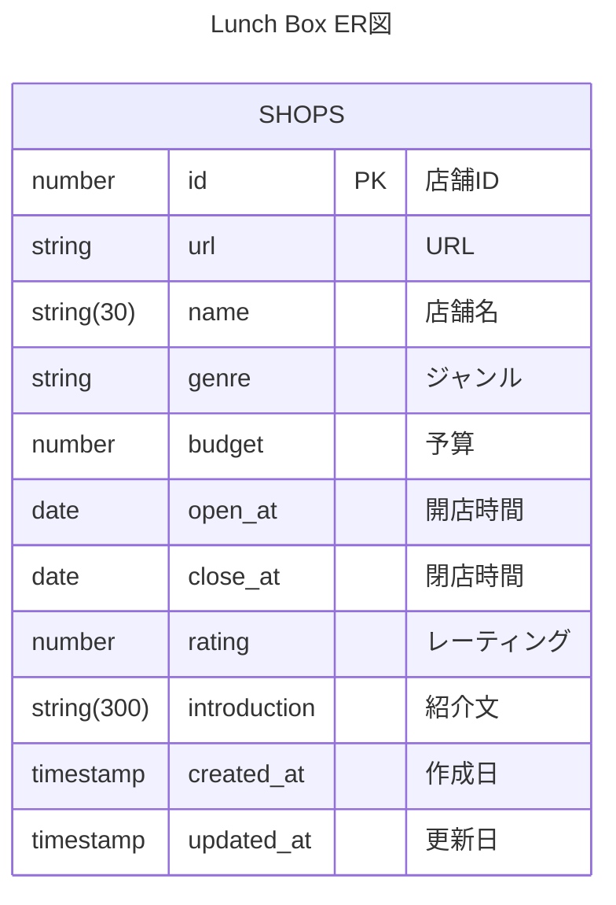

# lunch-box

ランチ検索用Webアプリケーション。

## 技術スタック

| ライブラリ・フレームワーク | 説明                           |
| -------------------------- | ------------------------------ |
| Vite                       | ビルドツール                   |
| TypeScript                 | 静的型付け言語                 |
| Vue.js                     | JavaScriptフレームワーク       |
| PrimeVue                   | Vue用UIコンポーネント          |
| Storybook                  | コンポーネントデザインカタログ |
| Vue Router                 | Vue.js用ルーターライブラリ     |
| Pinia                      | Vue.js用状態管理ライブラリ     |
| eslint                     | JavaScript静的解析ツール       |
| prettier                   | 整形ツール                     |

## ER図



## 画面イメージ

### トップ画面


### 検索画面


### 詳細画面


## 画面一覧

| No | 画面名 | パス | クエリ | meta title |
| :-: | --- | --- | --- | --- |
| 1 | トップ | `/` | - | トップ \| lunch-box |
| 2 | 検索 | `/search` | `keyword`：キーワード検索 | 検索 \| lunch-box |
| 3 | 店舗詳細 | `/shops/:id` | - | {店舗名} \| lunch-box |

## 🌳環境変数

スクリプトIDは、.clasp.jsonに指定する必要があります。  
このスクリプトIDをリポジトリ上に保存しないために、.envで管理しています。

```dotenv
# GASのスクリプトID
SCRIPT_ID=
```

一方で、スプレッドシートID（SPREADSHEET_ID）、店舗一覧を記載したシートID（SHOP_LIST_SHEET_ID）はGASのスクリプトプロパティに指定してください。

## scripts/について

### generate-clasp-json.ts

GASのスクリプトIDをGitHubにpushしないようにするため、.envに環境変数として設定し.clasp.jsonを生成しています。

### main.ts

Webアプリの配信のために必要なGAS用main.tsファイルです。

また、クライアント（HTML）側でGAS APIを実行するために、関数を定義しています。  
この関数は、GAS（サーバー）側での実行数をできるがぎり少なくするために、関数の処理をできるだけ大きくするように設計しています。
