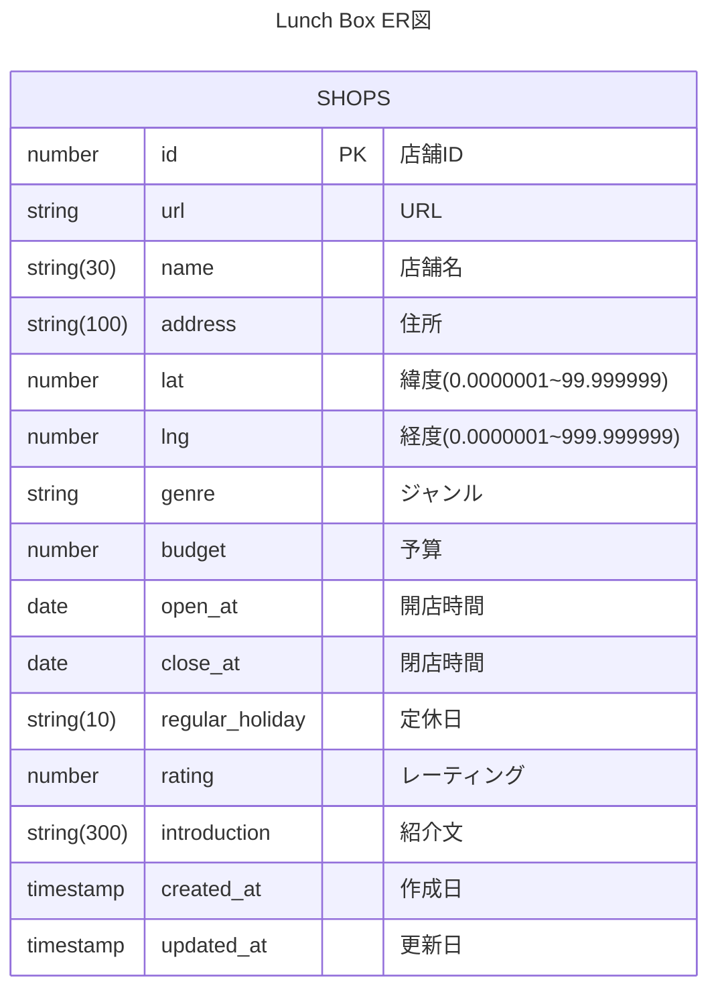

# lunch-box

ランチ検索用Webアプリケーション。

## 技術スタック

| ライブラリ・フレームワーク | 説明                           |
| -------------------------- | ------------------------------ |
| Vite                       | ビルドツール                   |
| TypeScript                 | 静的型付け言語                 |
| Vue.js                     | JavaScriptフレームワーク       |
| PrimeVue                   | Vue用UIコンポーネント          |
| Storybook                  | コンポーネントデザインカタログ |
| Vue Router                 | Vue.js用ルーターライブラリ     |
| Pinia                      | Vue.js用状態管理ライブラリ     |
| eslint                     | JavaScript静的解析ツール       |
| prettier                   | 整形ツール                     |

## 要件

- 飲食店を簡単に探すことができる
- 飲食店が決まらない場合に、飲食店をランダムで選出してくれる
- 飲食店のデータはURLを指定しておけば自動で(AIによって)データ化してくれる。

## ER図



## 店舗一覧について

このアプリケーションで表示や検索の対象となる店舗一覧はスプレッドシートで管理する想定です。  
作成したスプレッドシートのIDは[環境変数](#環境変数)を参照して設定してください。

テーブルは、以下のリストをヘッダーとして、順番に左から設定します。  
クライアント側でデータを取得したときはこの順番でデータが送信される想定です。順番を間違えてしまうとデータ定義もあべこべになってしまうので、気をつけてください。

- 店舗ID
- URL
- 店舗名
- 住所
- 緯度(lat)
- 経度(lng)
- ジャンル
- 予算
- 開店時間
- 閉店時間
- 定休日
- 評価
- 紹介文
- 作成日
- 更新日

### 店舗データの登録方法について

店舗データを登録するときに、Geminiを用いて店舗情報を取得する関数を用意しています。関数の詳細は`/scripts/main.js`を参照してください。

各ヘッダーに対してプロンプトは以下を参考にしてください。

| 対象データ | プロンプト |
| --- | --- |
| 店舗名 | B2&"URLから店舗名のみを抽出して1行で返してください。" |
| 住所 | B2&"URLから郵便番号と住所のみを抽出して1行で返してください。" |
| 緯度 | B2&"緯度のみを数字として抽出して1行で返してください。" |
| 経度 | B2&"経度のみを数字として抽出して1行で返してください。" |
| ジャンル | C2&"飲食店のジャンル（イタリアンや中華など）抽出して1行で返してください。" |
| 予算 | C2&"お昼ご飯を想定した予算を抽出して数字で1行（例えば、1500）で返してください。" |
| 開店時間 | C2&"お昼ご飯を想定した開店時間を抽出し、Googleスプレッドシートの時刻シリアル値で、表示形式を日時として1行（例えば、10:00）で返してください。" |
| 閉店時間 | D2&"お昼ご飯を想定した閉店時間を抽出し、表示形式を日時として1行（例えば、10:00）で返してください。" |
| 定休日 | C2&"お昼ご飯を想定した定休日を抽出して1行（例えば、毎週月曜日）で返してください。" |
| 評価 | C2&"評価を☆☆☆☆☆、★☆☆☆☆、★★☆☆☆、★★★☆☆、★★★★☆、★★★★★のどれか一つで返してください。" |
| 紹介文 | C2&"紹介文を300文字以内で返してください。" |

※ `B2`などは、スプレッドシートのセル番号です。

## 画面イメージ

### トップ画面


### 検索画面


- 全ての店舗データを一括取得し、フロント側でデータのフィルタリング、ソートを行う。

### 詳細画面


### 検索画面と詳細画面の削除

このアプリはGASにデプロイし、GAS APIを用いて通信する想定です。  
そのためAPI通信には制限があるため、極力通信回数を減らすことが重要となります。  
当初は検索画面、詳細画面を別々にして、各画面でAPI通信（スプレッドシートからデータを取得する通信）することを考えていましたが、上記の理由により画面の構造を変更することにしました。

つまり、

- 検索画面 → トップ画面と統合し、トップ画面のデータを使い回す。
- 詳細画面 → クリックしたらモーダルで表示し、トップ画面のデータを使い回す。

ことになります。

## 仕様

### 検索条件について

| 検索条件 | 要素         | 概要                               |
| -------- | ------------ | ---------------------------------- |
| ソート   | おすすめ順   | ランダムに並び替える               |
|          | 価格の安い順 |                                    |
|          | 価格の高い順 |                                    |
|          | 評価の高い順 |                                    |
| ジャンル | ...          |                                    |
| 価格帯   | 最低価格     |                                    |
|          | 最高価格     |                                    |
| 評価     | ...          | その星の数以上の店舗をフィルタする |

## 🌳環境変数

スクリプトIDは、.clasp.jsonに指定する必要があります。  
このスクリプトIDをリポジトリ上に保存しないために、.envで管理しています。

```dotenv
# GASのスクリプトID
SCRIPT_ID=
```

一方で、スプレッドシートID（`SPREADSHEET_ID`）、店舗一覧を記載したシートID（`SHOP_LIST_SHEET_ID`）はGASのスクリプトプロパティに指定してください。

また、[店舗データの登録方法について](#店舗データの登録方法について)に記載しましたが、Geminiによる店舗データの取得をしたい場合は、そのためのAPI Keyが必要になります。Gemini Language APIは[こちらの記事](https://zenn.dev/google_cloud_jp/articles/gemini-workspace-custom-function)を参考にAPI Keyを取得してください。取得したKeyを`GEMINI_API_KEY`に設定してください。

```
SPREADSHEET_ID
SHOP_LIST_SHEET_ID
GEMINI_API_KEY
```

## scripts/について

### generate-clasp-json.ts

GASのスクリプトIDをGitHubにpushしないようにするため、.envに環境変数として設定し.clasp.jsonを生成しています。

### main.ts

Webアプリの配信のために必要なGAS用main.tsファイルです。

また、クライアント（HTML）側でGAS APIを実行するために、関数を定義しています。  
この関数は、GAS（サーバー）側での実行数をできるがぎり少なくするために、関数の処理をできるだけ大きくするように設計しています。

さらに、店舗一覧をまとめたスプレッドシート内で使用する関数も含めています。
